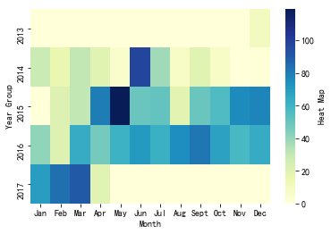
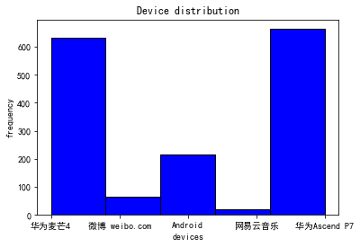
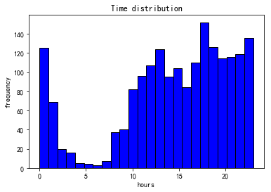

# weibo_analysis

A simple project to analyze my weibo data. 

it also help me to get familiar with the operations of String, csv, list, pandas and numpy in Python.

## Step

* Convert web page to csv file.
* Handle data via panda and numpy.
* Plot graph via matplotlib.

## Result

## Chinese info

* [中文介绍](https://luochang.ink/2019/04/20/%E6%88%91%E7%9A%84%E5%BE%AE%E5%8D%9A%E6%95%B0%E6%8D%AE%E5%8F%AF%E8%A7%86%E5%8C%96/)
